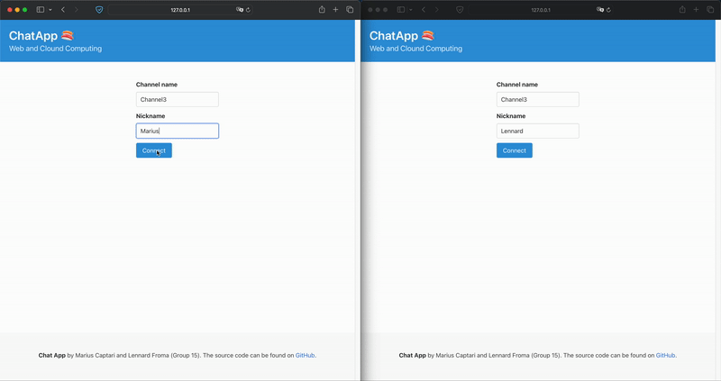

# Web and Cloud Computing - Group 15
**Chat App** made by Marius and Lennard.



## How to run
To start the front-end, back-end and in memory caching services run:
```shell
docker compose up -d
```

or to force rebuild the images:
```shell
docker compose up --force-recreate --build -d
```

The chat app should now be accessible at ```http://0.0.0.0:8000/```.

To clear all the database entries:
```shell
python manage.py flush
```

## Roadmap

- [ ] Search messages feature
- [ ] Cassandra DB
- [ ] Predefined dropdown channel selection
- [ ] Form validation from landing page
- [ ] Split front-end and back-end into two containers
